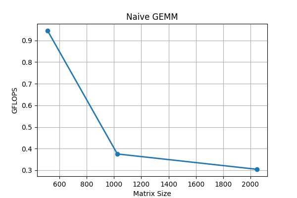

# GEMM Variants using HIP

This project basically focuses on improving GEMM (General Matrix Multiplication) by building a custom kernel using HIP.

The programs can be used as examples for someone trying to understand the patterns and profiling, and with a little bit of tweaking they can actually be used to perform matrix multiplication in any application.

At first, I wrote a code that is called naive GEMM. It simply fills matrices A and B, transfers them to the device memory, and performs multiplication with absolutely no fine-tuning.

  

This case is then improved with the tiled method, in which both matrices are divided into blocks and each block is given a certain number of threads. The threads are programmed in such a way that they store the sum for the values of the final matrix C in their registers. To understand the performance, I used different tile sizes from 8, 16, up to 32. Whichever configuration gave the highest GFLOPS was then used to generate the Matrix Size vs. GFLOPS plot.

The downside of the tiled method was that each thread inside the block was accountable for only one value of matrix C, which was creating a bottleneck by decreasing the occupancy. Hence, I tried register blocking. The main idea was that each thread would calculate more than one value of matrix C vertically (column-wise). I tried different variants starting from 1, 2, and 4 registers for tile sizes of 8, 16, and 32 to understand which performed the best. Based on the results, tile size 32 with a register blocking factor of 4 performed the best.

  

Another modified version, or an upgrade of this, was to add register blocking in the row direction, which means each thread accounts for values of matrix C in both directions. To benchmark this, I again used tile sizes of 8, 16, and 32 with register pairs in both directions ranging from 1 to 4. The configuration with tile size 32, vertical register blocking of 4, and horizontal register blocking of 1 outperformed all the other variants in the study.

  

  

I also attempted another technique called vectorized loading, which basically loads the data from global memory into shared memory using `int4` in C++. This means that instead of fetching one value at a time, it fetches four values at once. However, based on my understanding, it created a bottleneck because the second matrix needs to be fetched column-wise to perform the multiplication, whereas C++ stores arrays in row-major order. Nevertheless, it was a great learning experience.

  

  

